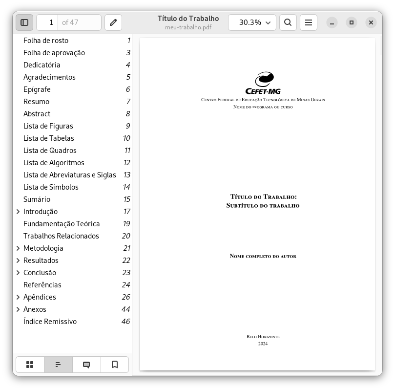

# LaTeX CEFET-MG [](https://github.com/cfgnunes/latex-cefetmg/actions)

Modelo não-oficial de trabalho acadêmico desenvolvido para os alunos do [CEFET-MG](http://www.cefetmg.br/).
Este projeto consiste em uma estrutura básica de arquivos em [LaTeX](https://www.latex-project.org/) para o desenvolvimento de trabalhos monográficos (TCC, Dissertação e Tese).
Inspirado no projeto [abnTeX2](https://github.com/abntex/abntex2).

## Apoie esse projeto! 💵

Você pode realizar doações de qualquer banco para a chave Pix:

**565a756e-b163-47a8-8414-efa230057600**

## Normas

Este modelo atende as seguintes normas vigentes da [ABNT](http://www.abnt.org.br/):

- **ABNT NBR 14724:2011**: Trabalhos acadêmicos
- **ABNT NBR 15287:2011**: Projeto de pesquisa
- **ABNT NBR 10520:2002**: Citações
- **ABNT NBR 6023:2002**: Referências
- **ABNT NBR 6024:2012**: Numeração progressiva das seções de um documento
- **ABNT NBR 6027:2012**: Sumário
- **ABNT NBR 6028:2003**: Resumo
- **ABNT NBR 6034:2004**: Índice

[](https://www.overleaf.com/latex/templates/latex-cefetmg/vtpykndsqtkf)

É possível utilizar esse modelo online ou instalando o LaTeX em seu computador.

## Utilizando o modelo online

Vantagens:

- não precisa instalar o LaTeX;
- permite editar seu trabalho em diferentes computadores;
- permite compartilhar o texto online com outras pessoas de forma simples.

Desvantagem:

- só poderá editar seu trabalho se estiver conectado na Internet.

Para utilizar o LaTeX online você deve se registrar gratuitamente no [Overleaf](https://www.overleaf.com/latex/templates/latex-cefetmg/vtpykndsqtkf).
Note que existe uma versão paga do Overleaf, que oferece funcionalidades que podem ser desejáveis, mas não são necessárias.

Para abrir este modelo diretamente no Overleaf, [clique aqui](https://www.overleaf.com/latex/templates/latex-cefetmg/vtpykndsqtkf).

## Utilizando o modelo em seu computador (usando GNU/Linux)

### Pré-requisitos

Esta seção assume o sistema operacional Ubuntu 16.04 (também testado no Ubuntu 20.04), mas o procedimento é semelhante para outras distribuições GNU/Linux.
Para poder compilar o documento, basta instalar os seguintes pacotes no terminal:

```sh
sudo apt -y install \
    make \
    latexmk \
    texlive \
    texlive-lang-portuguese \
    texlive-latex-extra \
    texlive-publishers \
    texlive-science \
    texlive-xetex \
    texlive-fonts-extra
```

### Compilar documento

Para compilar o projeto e gerar o documento no formato PDF, você pode executar o seguinte comando no terminal:

```sh
make
```

## Contribuindo

Se você encontrar um problema ou quiser melhorar o código, ou até mesmo melhorar o conteúdo, você pode:

- [Abrir um problema](https://github.com/cfgnunes/latex-cefetmg/issues/new) descrevendo o erro ou a ideia de uma funcionalidade nova;
- Criar um _fork_ do projeto, realizar mudanças, e submeter um _pull request_.
